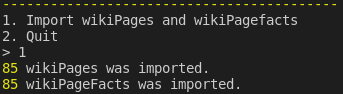
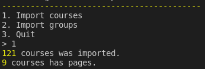
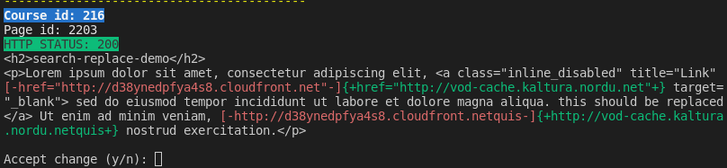
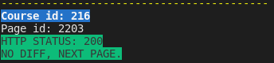
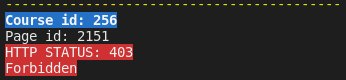

# canvas-search-replace

Helper tool for programmatic search and replace operations using canvas api

## Description

## Installation

1. clone this repo
2. `npm install`
3. `mkdir data`

## Usage

### Tables from Canvas data dump

Sync and unpack the following tables from Canvas Data dump:

1. wiki_page_dim
2. wiki_page_fact
3. group_dim
4. course_dim

Move the txt-files to `data/`  
Canvas Data Schema Documentation: https://portal.inshosteddata.com/docs

### Define your substitutions

Create `substitutions.js` in `data/`.  
It's a javascript file with the search and replace operations you wish to do.  
Syntax:

```js
export const data = [
  { from: "d38ynedpfya4s8.cloudfront.net", to: "vod-cache.kaltura.nordu.net" },
  { from: "dchsou11xk84p.cloudfront.net", to: "api.kaltura.nordu.net" },
];
```

### Run the app

`npm run start`

Importing pages from `wiki_page_dim.txt`  


Importing courses from `course_dim.txt`  


Updating courses. Word diff review before commit  


If run again after update, we get no diff.  


If page was deleted we get a 403 forbidden.  

